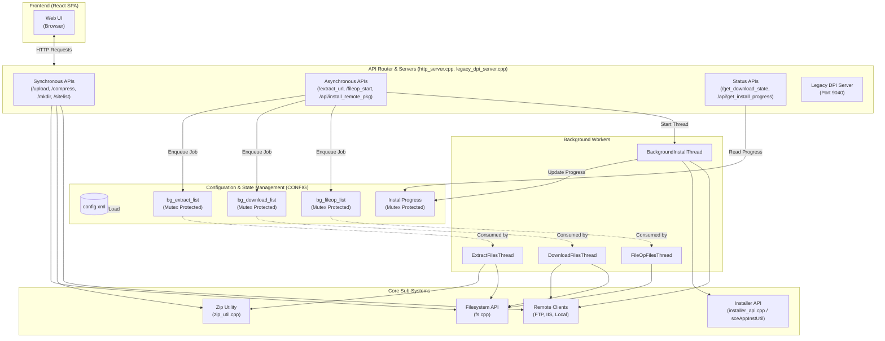

# ezRemote Architecture Diagram

The following Mermaid diagram outlines the high-level architecture, showing the interaction between the React frontend, the embedded HTTP server APIs, background tasks, and core sub-systems.

## Description of Layers

1. **Frontend**: The React Single Page Application loaded by the client browser. It sends HTTP JSON payloads to the backend API endpoints.
2. **API Router**: The embedded C++ `cpp-httplib` server listening on port `6701`. It handles requests, parses JSON via `json-c`, and routes to the appropriate C++ handler.
    - **Synchronous APIs** execute directly within the HTTP handler thread, blocking the client until complete.
    - **Asynchronous APIs** validate input and quickly enqueue jobs into background state lists, returning immediately.
3. **Configuration & State Management**: Globally accessible lists (`CONFIG` namespace) that track active downloads, extractions, and file operations. They use strict `std::mutex` locking to prevent data races. `InstallProgress` is managed by `PkgInstallUseCase` with its own lock.
4. **Background Workers**: Persistent POSIX threads (`pthreads`) that poll the queues (`sleep(1)` loop) or are spawned ad-hoc. They delegate intensive I/O to sub-systems.
5. **Core Sub-Systems**: Low-level modules wrapping the PS5 SDK, POSIX file I/O, `libarchive`/`minizip`, and network clients (`CURL`).
