# ezRemote Client Diagrams

This document summarizes the repository structure and runtime behavior using Mermaid diagrams. It was created from a scan of the native PS5 client, embedded web UI, remote protocol clients, installer flows, local HTTP server, and bundled payload subprojects.

## 1. Repository Map

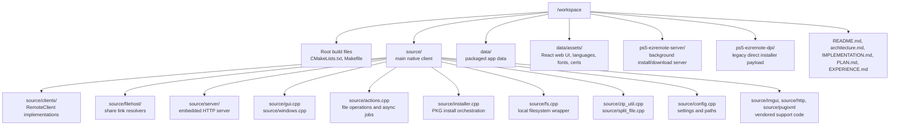

## 2. Build And Package Graph

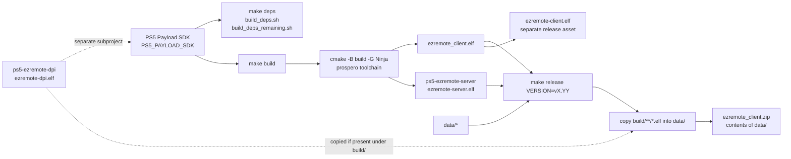

## 3. Native Client Runtime Architecture

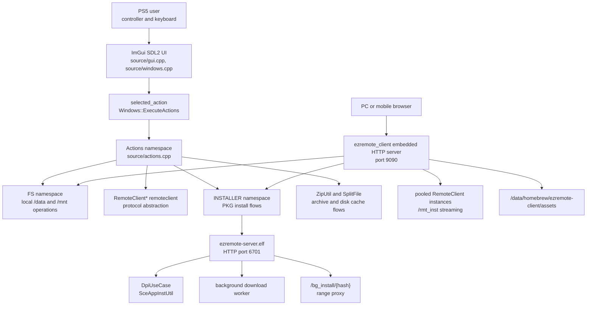

## 4. Application Startup Sequence

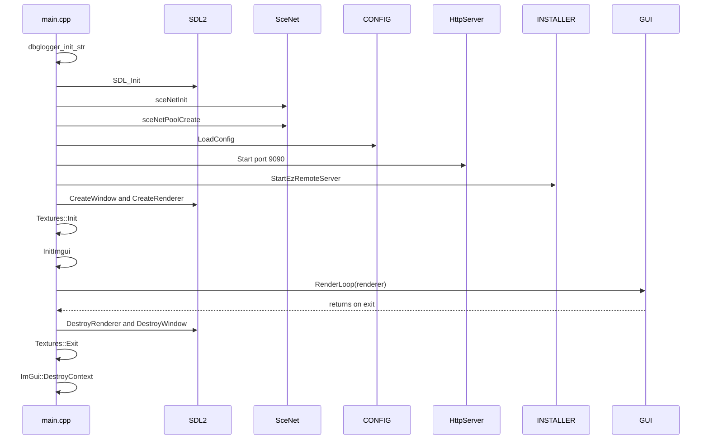

## 5. Main Render Loop

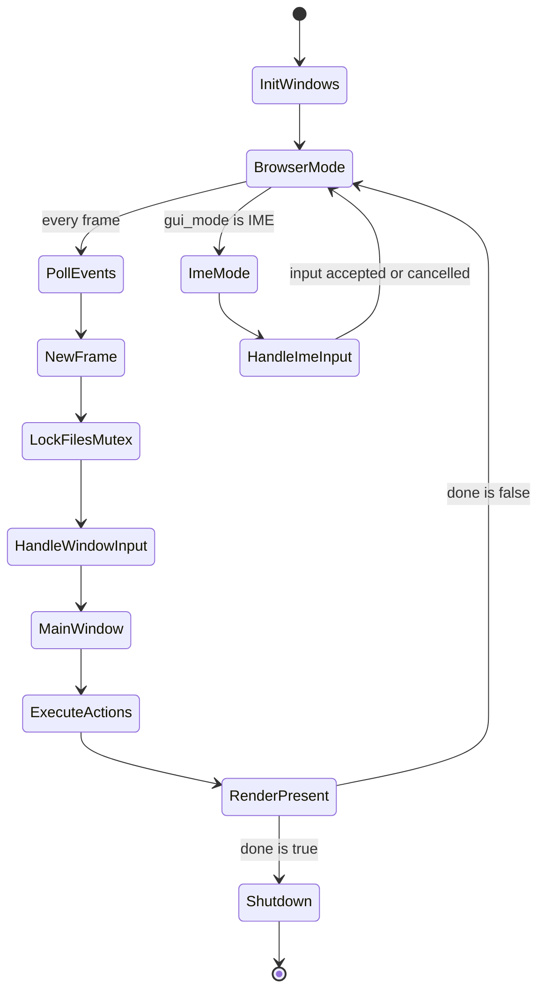

## 6. UI Action Dispatch

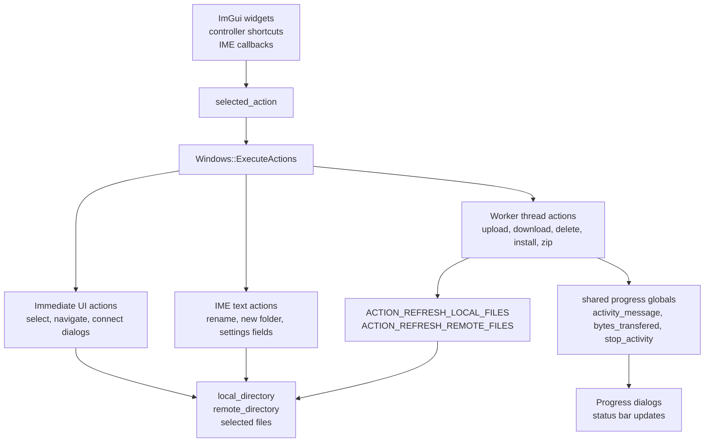

## 7. Remote Client Class Model

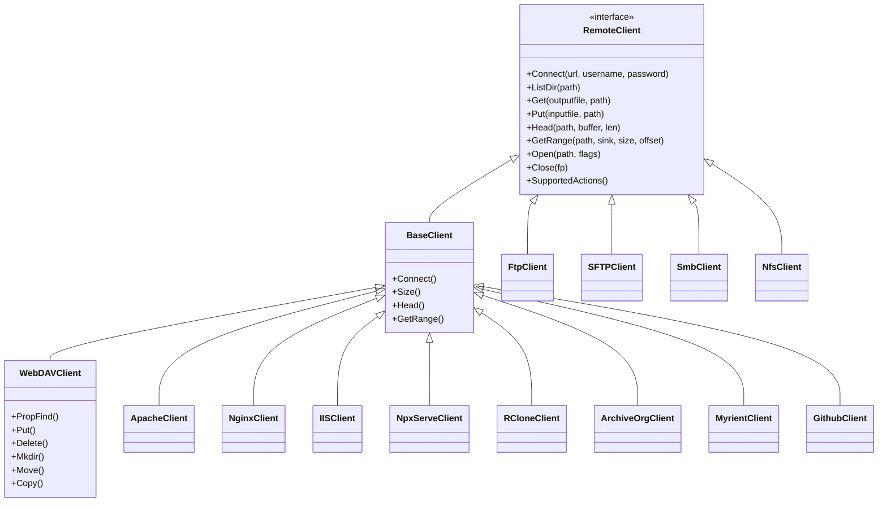

## 8. Remote Connection Selection

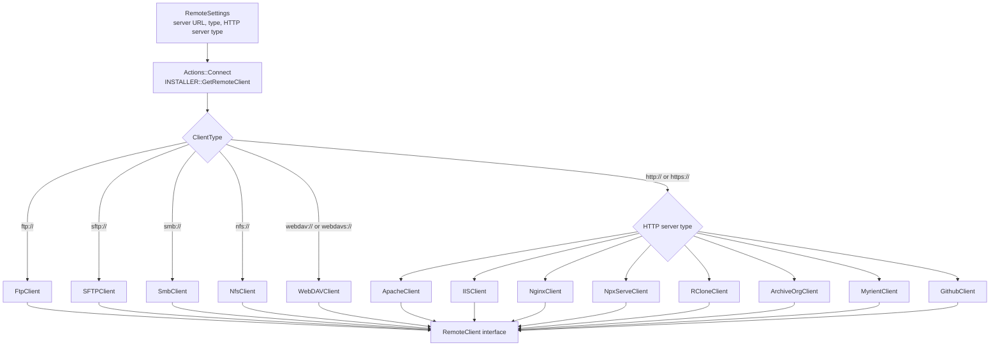

## 9. Remote Capability Families

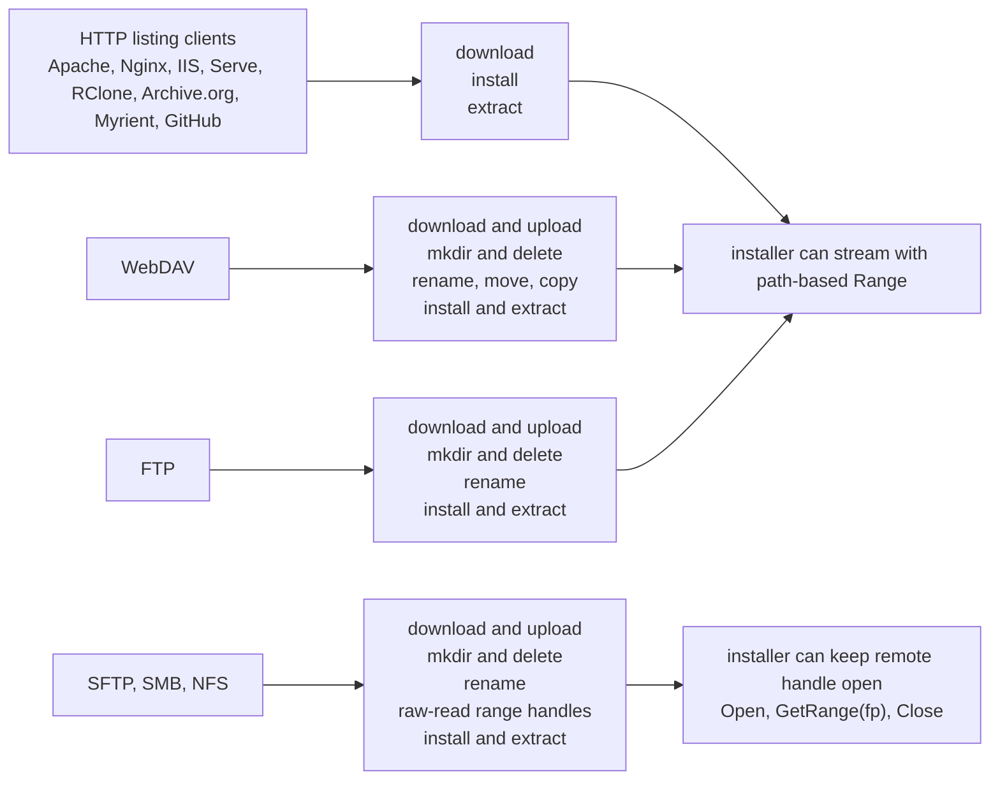

## 10. Filehost URL Resolution

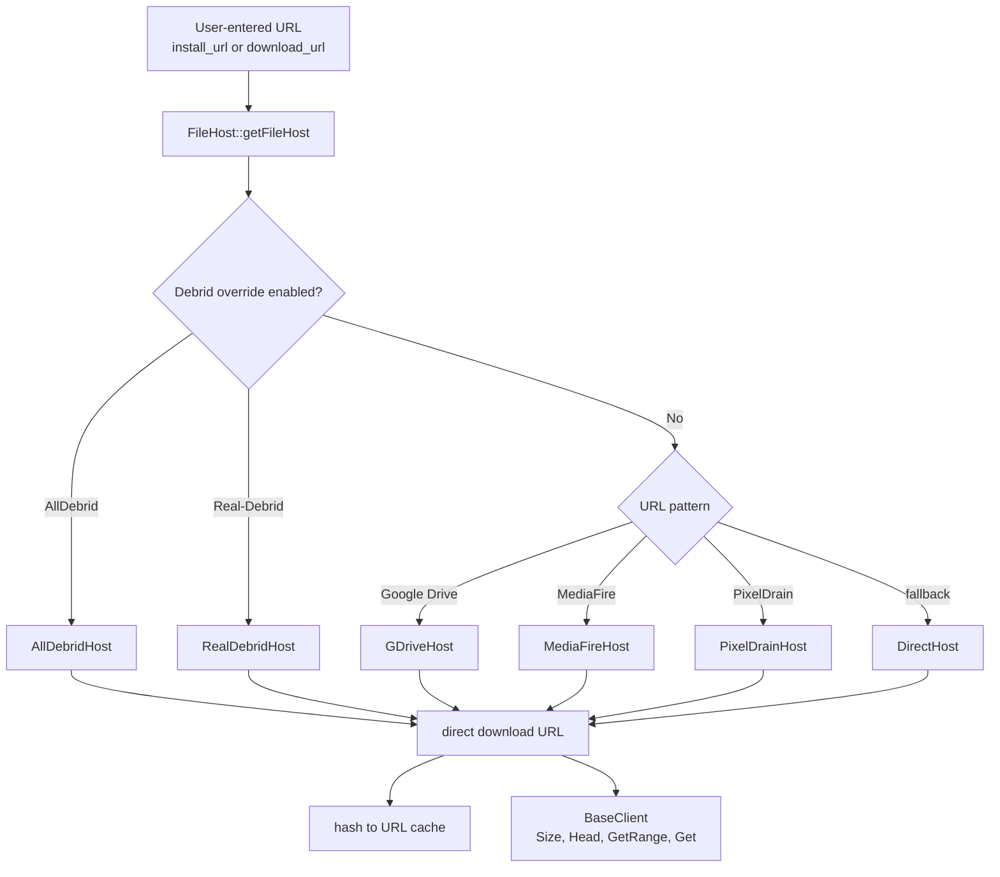

## 11. Embedded Client HTTP Server

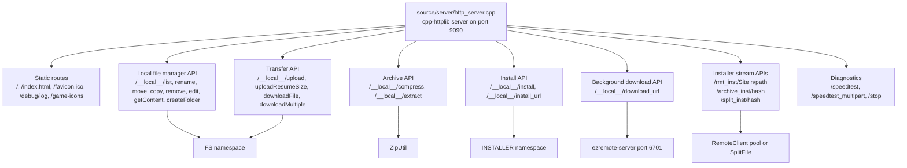

## 12. Browser Web UI Flow

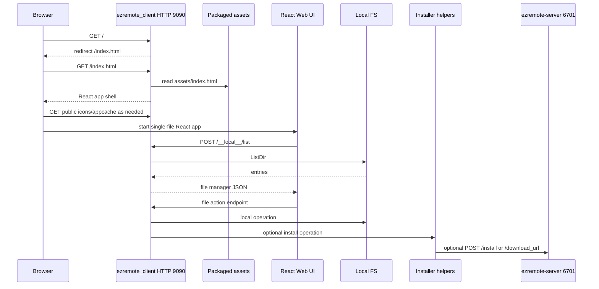

## 13. Web Chunk Upload Flow

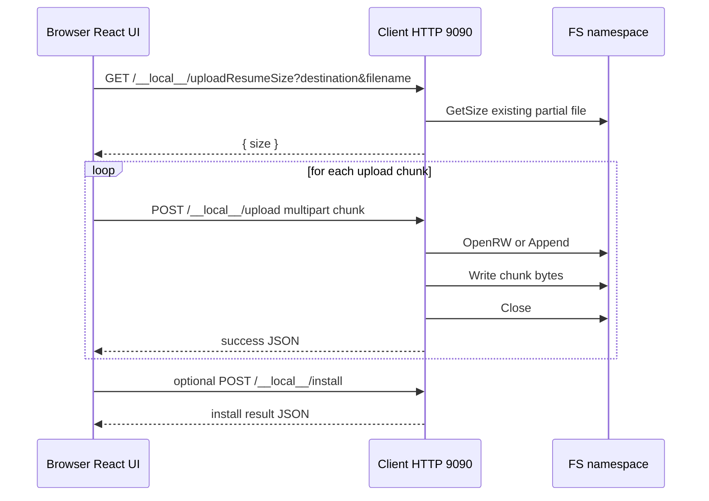

## 14. Local File Operation Flow

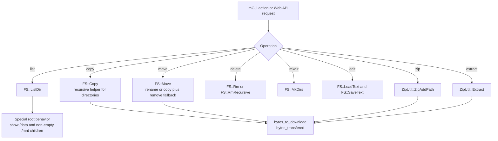

## 15. Local PKG Install Flow

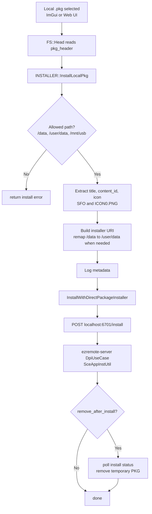

## 16. Remote PKG Install Decision Tree

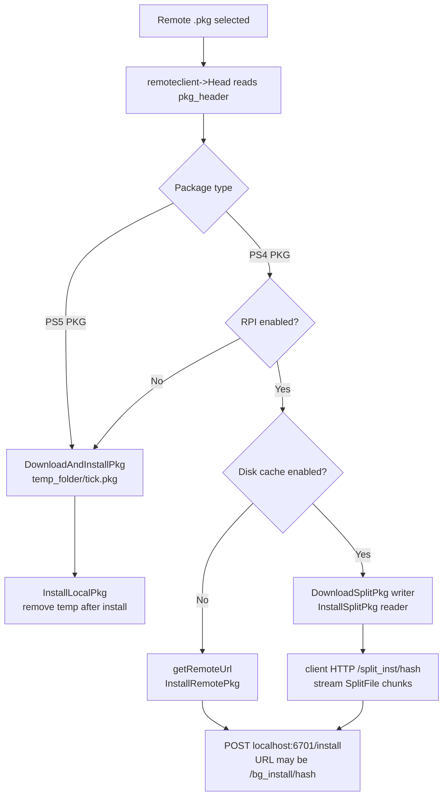

## 17. Remote Package Install With Background Proxy

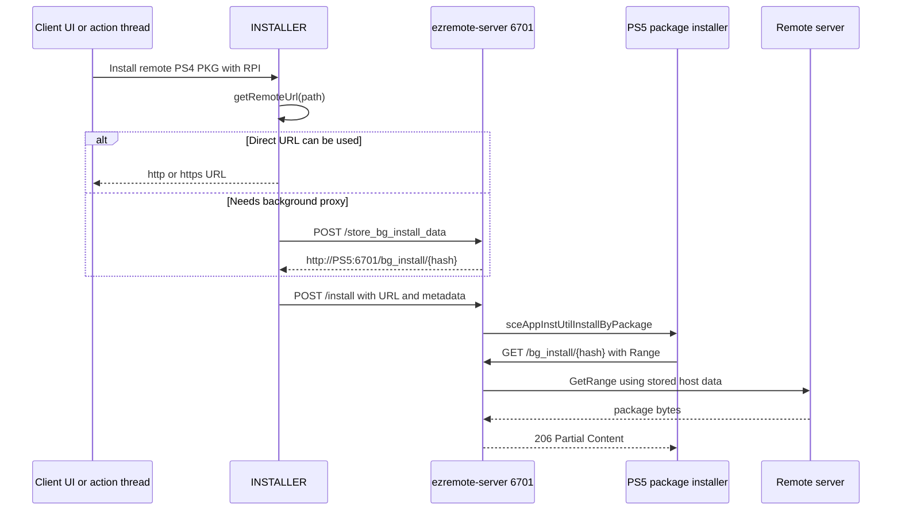

## 18. Disk Cache SplitFile Flow

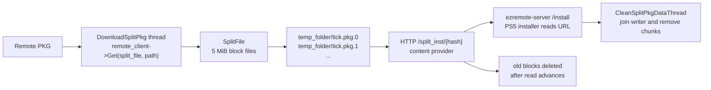

## 19. Archive PKG Install Flow

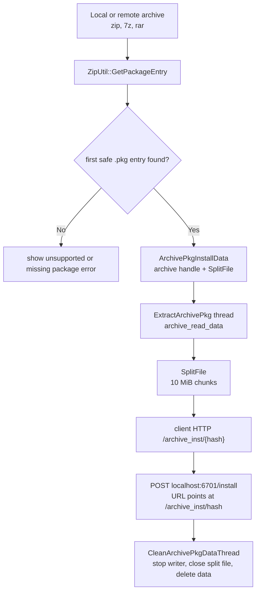

## 20. SplitFile Producer Consumer Lifecycle

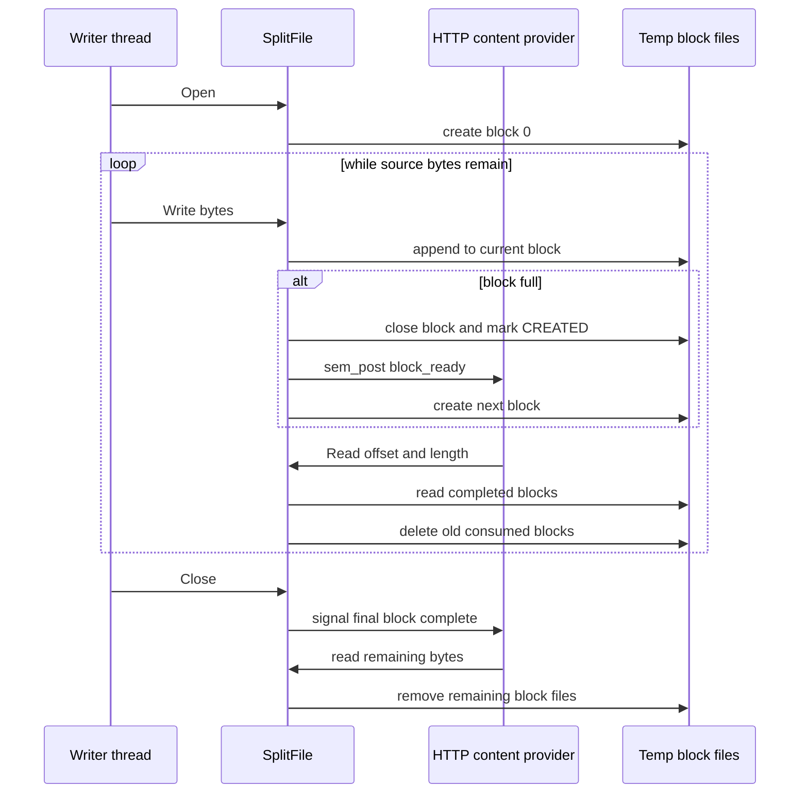

## 21. ezRemote Server Runtime

```mermaid
flowchart TB
    ServerMain["ps5-ezremote-server/source/main.cpp"] --> LoadInstallHistory["Load package install host data"]
    ServerMain --> LoadDownloads["Load background download history"]
    ServerMain --> DpiInit["DpiUseCase::Initialize"]
    ServerMain --> Legacy["LegacyDpiServer\nTCP port 9040"]
    ServerMain --> DownloadThread["Background download thread"]
    ServerMain --> Http["HTTP server\nport 6701"]

    Http --> Store["POST /store_bg_install_data"]
    Http --> BgInstall["GET /bg_install/{hash}"]
    Http --> Install["POST /install"]
    Http --> DownloadUrl["POST /download_url"]
    Http --> DownloadState["GET /get_download_state"]
    Http --> Version["GET /version"]
    Http --> Static["static assets and /game-icons"]

    Store --> PersistPkg["pkg_install_history.json"]
    BgInstall --> Remote["remote range client"]
    Install --> Sce["SceAppInstUtil"]
    DownloadUrl --> Queue["download queue"]
    Queue --> DownloadThread
    DownloadThread --> PersistDownloads["bg_download_history.json"]
```

## 22. Background Download State Machine

```mermaid
stateDiagram-v2
    [*] --> Queued
    Queued --> Downloading: worker picks item
    Downloading --> Resumed: temp file exists
    Resumed --> Downloading: continue from offset
    Downloading --> Completed: expected size reached
    Downloading --> Failed: transfer or size error
    Failed --> Queued: server restart or retry path
    Completed --> [*]
```

## 23. Background Download Sequence

```mermaid
sequenceDiagram
    participant UI as ImGui action or Web UI
    participant Client as ezremote_client
    participant Resolver as FileHost and BaseClient
    participant Server as ezremote-server 6701
    participant Worker as DownloadFilesThread
    participant Disk as Destination path

    UI->>Client: request background download URL
    Client->>Resolver: resolve filehost and validate size
    Resolver-->>Client: direct URL and file size
    Client->>Server: POST /download_url
    Server->>Server: persist queued item
    Server-->>Client: success JSON
    Server->>Worker: queue item
    Worker->>Disk: write dest.tmp
    Worker->>Server: update bytes_transfered and state
    Worker->>Disk: rename dest.tmp to final dest
    UI->>Server: GET /get_download_state
    Server-->>UI: progress array
```

## 24. Remote Range Proxy Flow

```mermaid
sequenceDiagram
    participant Installer as PS5 package installer
    participant ClientHttp as ezremote_client HTTP 9090
    participant Pool as RemoteClient pool
    participant Remote as Remote server

    Installer->>ClientHttp: GET /rmt_inst/Site n/path with Range
    ClientHttp->>Pool: GetPooledClient(site_idx)
    Pool-->>ClientHttp: RemoteClient
    ClientHttp->>Remote: GetRange(path, sink, size, offset)
    Remote-->>ClientHttp: requested bytes
    ClientHttp-->>Installer: 206 Partial Content
    ClientHttp->>Pool: ReleasePooledClient(site_idx)
```

## 25. Configuration And Persistence

```mermaid
flowchart TB
    ConfigIni["/data/homebrew/ezremote-client/config.ini"] --> LoadConfig["CONFIG::LoadConfig"]
    LoadConfig --> Globals["Global runtime settings"]
    LoadConfig --> Sites["site_settings map\nRemoteSettings per site"]
    LoadConfig --> Secrets["encrypted passwords\nDebrid API keys"]
    LoadConfig --> Paths["local_directory\nremote defaults\ntemp_folder"]

    Globals --> UI["settings dialogs"]
    Sites --> Connect["Actions::Connect"]
    Paths --> FS["FS and installer temp paths"]
    Secrets --> Remote["RemoteClient authentication\nFileHost debrid APIs"]

    UI --> SaveGlobal["CONFIG::SaveGlobalConfig"]
    Connect --> SaveConfig["CONFIG::SaveConfig"]
    FS --> SaveLocal["CONFIG::SaveLocalDirecotry"]
    SaveGlobal --> ConfigIni
    SaveConfig --> ConfigIni
    SaveLocal --> ConfigIni
```

## 26. Runtime Path Layout

```mermaid
flowchart TB
    DataPath["/data/homebrew/ezremote-client"]
    DataPath --> ClientElf["ezremote_client.elf"]
    DataPath --> ServerElf["ezremote-server.elf"]
    DataPath --> DpiElf["ezremote-dpi.elf constant\nlegacy path"]
    DataPath --> ConfigIni["config.ini"]
    DataPath --> Assets["assets/\nweb UI, langs, fonts, certs"]
    DataPath --> Tmp["tmp/\ntemporary PKG and split chunks"]
    DataPath --> Compressed["compressed_files/\nweb downloadMultiple and compress output"]
    DataPath --> GameIcons["game-icons/\nextracted package icons"]
    DataPath --> TmpSfo["tmp_pkg.sfo"]
    DataPath --> TmpIcon["tmp_icon.png"]
    DataPath --> Logs["client.log\nserver.log"]
    DataPath --> Histories["pkg_install_history.json\nbg_download_history.json"]
```

## 27. Web Asset Layer

```mermaid
flowchart TB
    Assets["data/assets/"] --> Index["index.html"]
    Assets --> Public["public icons\nfavicon.svg, icon.png, cache.appcache"]
    Assets --> Langs["langs/*.ini\nnative UI translations"]
    Assets --> Fonts["fonts/*.ttf\nnative UI fonts"]
    Assets --> Certs["certs/cacert.pem"]

    Index --> Bundle["inline React/Vite JS and CSS"]
    Bundle --> Toasts["toasts for /__local__ calls"]
    Bundle --> NavFilter["root navigation filter\n/data and /mnt only"]
    Bundle --> Search["recursive search and filters"]
    Bundle --> UploadOverride["chunk upload\nresume probes"]
    Bundle --> DropPkg["Drop PKG flow\nupload then install"]
    Bundle --> Layout["topbar, breadcrumbs, table, toasts"]

    Bundle --> LocalApi["/__local__/ endpoints"]
    DropPkg --> LocalApi
    UploadOverride --> LocalApi
```

## 28. Thread And Async Work Map

```mermaid
flowchart TB
    MainThread["Main UI thread\nGUI::RenderLoop"] --> ServerThread["HttpServer::ServerThread\ndetached"]
    MainThread --> ActionWorkers["Action worker threads\ndownload, upload, delete, install, zip"]
    MainThread --> KeepAlive["FTP KeepAliveThread"]
    MainThread --> BgServerStart["StartEzRemoteServer\npayload loader interaction"]

    ActionWorkers --> SharedGlobals["shared globals\nactivity_inprogess, file_transfering, status_message"]
    ActionWorkers --> FilesMutex["files_mutex guards UI file list updates"]
    ActionWorkers --> SplitWriters["Split/cache writer threads"]
    SplitWriters --> CleanupThreads["CleanArchivePkgDataThread\nCleanSplitPkgDataThread"]

    ServerPayload["ezremote-server process"] --> ServerHttpThread["HTTP server thread"]
    ServerPayload --> LegacyThread["legacy DPI TCP server"]
    ServerPayload --> DownloadThread["background download worker"]
```

## 29. Installer Mode Comparison

```mermaid
flowchart LR
    Package["PKG source"] --> Mode{"Install mode"}
    Mode --> Local["Local install\nsource already on /data or /mnt"]
    Mode --> Temp["RPI disabled\ndownload whole PKG to temp"]
    Mode --> Rpi["RPI enabled\nstream remote URL or proxy"]
    Mode --> DiskCache["RPI plus disk cache\nSplitFile chunks"]
    Mode --> Archive["PKG inside archive\nextract into SplitFile chunks"]

    Local --> Dpi["POST localhost:6701/install"]
    Temp --> Dpi
    Rpi --> Dpi
    DiskCache --> ClientHttp["client HTTP /split_inst/hash"]
    Archive --> ClientHttpArchive["client HTTP /archive_inst/hash"]
    ClientHttp --> Dpi
    ClientHttpArchive --> Dpi
    Dpi --> Sce["SceAppInstUtil"]
```

## 30. Payload Relationship

```mermaid
flowchart TB
    Client["ezremote_client.elf\ninteractive app"] --> StartServer["INSTALLER::StartEzRemoteServer"]
    StartServer --> Loader["localhost payload loader\nport 9021"]
    Loader --> Server["ezremote-server.elf"]

    Client --> ServerHttp["HTTP calls to localhost:6701"]
    ServerHttp --> Install["/install"]
    ServerHttp --> Store["/store_bg_install_data"]
    ServerHttp --> Download["/download_url"]
    ServerHttp --> State["/get_download_state"]
    ServerHttp --> Version["/version"]

    Server --> Legacy["legacy DPI compatibility\nTCP 9040"]
    Dpi["ezremote-dpi.elf\nstandalone legacy installer"] -.->|separate subproject| LegacyPurpose["simple TCP URL installer\nport 9040"]
```

## 31. Data Flow For Remote Browsing And Transfer

```mermaid
flowchart TB
    Connect["Connect to site"] --> RemoteClient["RemoteClient instance"]
    RemoteClient --> List["ListDir(remote_directory)"]
    List --> RemoteFiles["remote_files vector\nDirEntry objects"]
    RemoteFiles --> UI["Remote pane"]

    UI --> Download["Download selected remote files"]
    Download --> RemoteGet["remoteclient->Get(local path, remote path)"]
    RemoteGet --> LocalDisk["PS5 local disk"]

    UI --> Upload["Upload selected local files"]
    Upload --> RemotePut["remoteclient->Put(local path, remote path)"]
    RemotePut --> RemoteServer["remote server storage"]

    UI --> RemoteEdit["remote edit"]
    RemoteEdit --> TempEditor["tmp_editor.txt"]
    TempEditor --> RemotePut
```

## 32. API Response Contract

```mermaid
flowchart LR
    Handler["/__local__ handler"] --> Validate["parse and validate JSON\nquery, or multipart fields"]
    Validate --> Work["perform FS, archive, install, or queue operation"]
    Work --> Result{"success?"}
    Result -->|"Yes"| Success["{ result: { success: true, error: null } }"]
    Result -->|"No"| Failure["{ result: { success: false, error: message } }"]
    Success --> React["React Web UI"]
    Failure --> React
```
